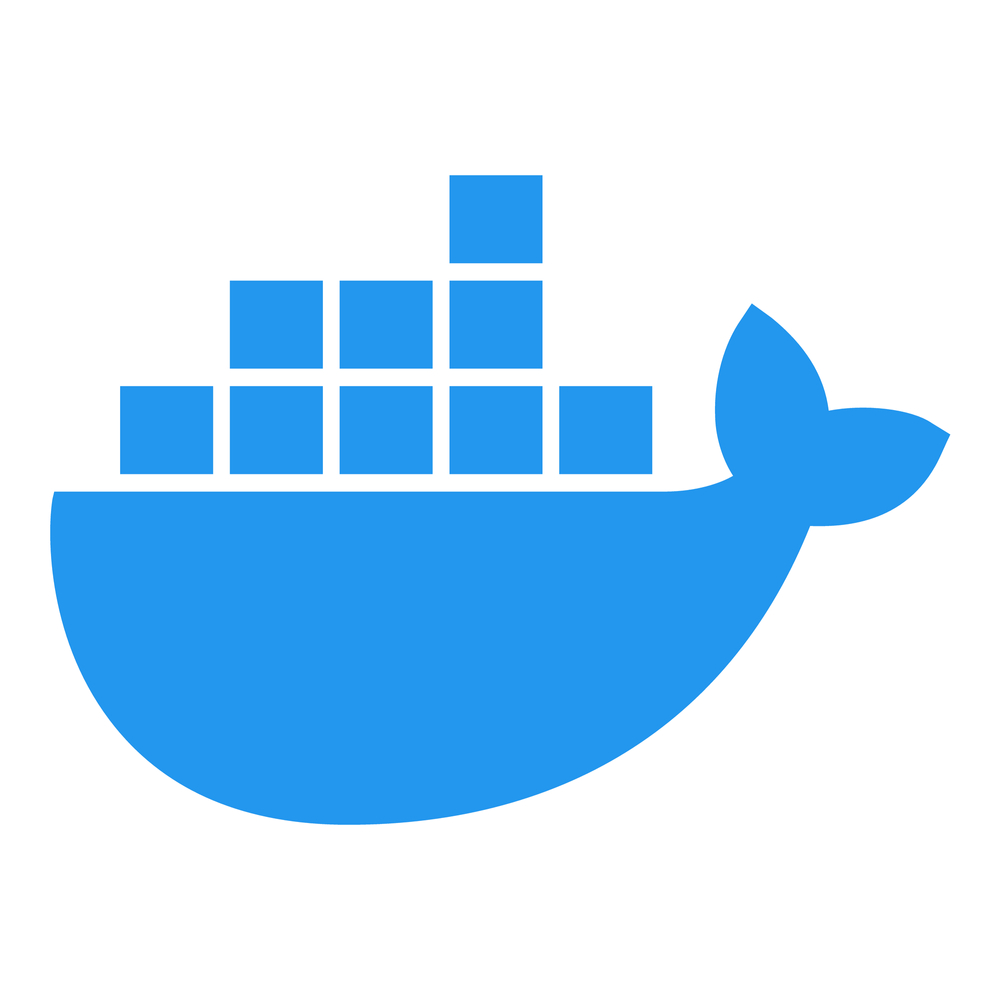

# DOCKERFILES
It's about how to create Dockerfiles for various frameworks and libraries

# Introduction 
This project explores the use of Docker for the deployment of modern web applications.

# Getting Started


## INSTALLATION

1. Clone the repository:
   ```bash
   git clone https://github.com/Brandon22030/App-deployment-with-docker.git
   ```

<br>

# Usage

### Vuejs
<!--  -->


### 1. Create your project
   ```bash
   npm create vue@latest
   ```
*make sure the dockerfile is in the project folder*

### 2. Build the Dockerfile
   ```bash
   sudo docker build -t vuejs-docker .
   ```

### 3. Run the Dockerfile
   ```bash
   sudo docker run -it -p 5073:5073 vuejs-docker
   ```
**check your website on http://localhost:5073**


##
### Reactjs
<!--  -->


### 1. Create your project
   ```bash
   npx create-react-app reactjs-docker
   ```
*make sure the dockerfile is in the project folder*

### 2. Build the Dockerfile
   ```bash
   sudo docker build -t reactjs-docker .
   ```

### 3. Run the Dockerfile
   ```bash
   sudo docker run  -it -p 4000:80 —name docker-react-container reactjs-docker
   ```
**check your website on http://localhost:4000**


##
### Laravel
<!--  -->


### 1. Create your project
   ```bash
   composer create laravel/laravel laravel-docker-app
   ```
*make sure the dockerfile is in the project folder*

### 2. Build the Dockerfile
   ```bash
   sudo docker build -t laravel-docker .
   ```

### 3. Run the Dockerfile
   ```bash
   sudo docker run  -it -p 8000:8000 —name docker-laravel-container laravel-docker
   ```

**check your website on http://localhost:8000**


##
### NestJS
<!--  -->


### 1. Create your project
   ```bash
   npm i -g @nestjs/cli
   ```

   ```bash
   nest new nestjs–docker
   ```

*make sure the dockerfile is in the project folder*

### 2. Build the Dockerfile
   ```bash
   sudo docker build -t nestjs-docker . 
   ```

### 3. Run the Dockerfile
   ```bash
   sudo docker run  -it -p 3000:3000 —name docker-nestjs-container nestjs-docker
   ```
**check your website on http://localhost:3000**


##
### NextJS
<!--  -->


### 1. Create your project
   ```bash
   npx create-next-app@latest
   ```

*make sure the dockerfile is in the project folder*

### 2. Build the Dockerfile
   ```bash
   sudo docker build -t nextjs-docker .
   ```

### 3. Run the Dockerfile
   ```bash
   sudo docker run  -it -p 3000:3000 —name docker-nextjs-container nextjs-docker
   ```
**check your website on http://localhost:3000**


##
### NuxtJS
<!--  -->


### 1. Create your project
   ```bash
   npx nuxi@latest init nuxtjs-docker-app
   ```

*make sure the dockerfile is in the project folder*

### 2. Build the Dockerfile
   ```bash
   sudo docker build -t nuxtjs-docker .
   ```

### 3. Run the Dockerfile
   ```bash
   sudo docker run  -it -p 3000:3000 —name docker-nuxtjs-container nuxtjs-docker
   ```
**check your website on http://localhost:3000**


##
### React Native
<!--  -->


### 1. Create your project
   ```bash
   npx react-native init react-native-docker
   ```

*make sure the dockerfile is in the project folder*

### 2. Build the Dockerfile
   ```bash
   sudo docker build -t reactNative-docker .
   ```

### 3. Run the Dockerfile
   ```bash
   sudo docker run  -it -p 3000:3000 —name docker-reactNative-container reactNative-docker
   ```
**check your website on http://localhost:8081**


#
### Flask
<!--  -->


### 1. Create a directory named "Flask-Docker-App"
   ```bash
   mkdir Flask-Docker-App
   ```

### 2. Navigate to the newly created directory
   ```bash
   cd Flask-Docker-App
   ```

### 3. Create a virtual environment

**Windows**
   ```bash
   py -3 -m venv venv
   ```
**macOS/Linux**
   ```bash
   python3 -m venv venv
   ```

### 4. Activate the environment

**Windows**
   ```bash
   venv\Scripts\activate
   ```
**macOS/Linux**
   ```bash
   . venv/bin/activate
   ```

### 5. Install Flask
   ```bash
   pip install Flask
   ```

### 6. Create the required files

**Create three files:** *app.py, requirements.txt and Dockerfile*
   ```bash
   touch app.py requirements.txt Dockerfile
   ```

### 7. app.py content

You can add this into your app.py file

   ```bash
   from flask import Flask
   app = Flask(__name__)
   @app.route('/')
   def hello_geek():
   return '<h1>Hello from Flask & Docker</h2>'
   if __name__ == "__main__":
   app.run(debug=True)
   ```

### 8. requirements.txt content

*Here, All we need is the flask module for our little workshop.*

*You can check your flask version by typing : **pip freeze***

   ```bash
   flask==3.0.3
   ```

*Now, make sure the dockerfile is in the project folder*

### 9. Build the Dockerfile
   ```bash
   sudo docker build -t flask-docker . 
   ```

### 10. Run the Dockerfile
   ```bash
   sudo docker run  -it -p 5000:5000 —name docker-flask-container flask-docker
   ```

**check your website on http://127.0.0.1:5000 / http://127.0.0.2:5000**


##
### NodeJS with Express

<!-- 
 -->


### 1. Getting your project ready

Open your terminal and go to where you want your project to be. Start a new Node.js project by typing:
   ```bash
   npm init
   ```
*Answer the questions to create a package.json file. This file keeps track of your project details and the packages you use.*

### 2. Adding Expres
To add express, which helps you manage your server, type:
   ```bash
   npm install express
   ```
*This command adds Express to your project and lists it as a necessary package in package.json*


### 3. Create an Express Server (Optional)
*Now that Express is installed, create a new serve.js file and open it with your code editor. Then, add the following lines of code:*
   ```bash
   const express = require('express');
   const app = express();
   ```

*The first line here is grabbing the main Express module from the package you installed. This module is a function, which we then run on the second line to create our app variable. You can create multiple apps this way, each with its own requests and responses.*
   ```bash
   const express = require('express');
   const app = express();
   app.get('/', (req, res) => {
   res.send('Successful response.');
   });
   ```

*These lines of code is where we tell our Express server how to handle a GET request to our server. Express includes similar functions for POST, PUT, etc. using app.post(...), app.put(...), etc.*

*These functions take two main parameters. The first is the URL for this function to act upon. In this case, we are targeting '/', which is the root of our website: in this case, **localhost:3000**.*

*The second parameter is a function with two arguments: req, and res. req represents the request that was sent to the server; We can use this object to read data about what the client is requesting to do. res represents the response that we will send back to the client.*

*Here, we are calling a function on res to send back a response: 'Successful response.'.*
   ```bash
   const express = require('express');
   const app = express();
   app.get('/', (req, res) => {
   res.send('Successful response.');
   });
   app.listen(3000, () => console.log('Example app is listening on port 3000.'));
   ```

*Finally, once we’ve set up our requests, we must start our server! We are passing 3000 into the listen function, which tells the app which port to listen on. The function passed in as the second parameter is optional and runs when the server starts up. This provides us some feedback in the console to know that our application is running.*

*Revisit your terminal and run your application:* 
   ```bash
   node server.js
   ```
*Then, visit **localhost:3000** in your web browser. Your browser window will display: 'Successful response'. Your terminal window will display: 'Example app is listening on port 3000.'.*

### 4. Build the Dockerfile
*Make sure the dockerfile is in the project folder*
   ```bash
   sudo docker build -t nodejs-expressjs-docker . 
   ```

### 5. Run the Dockerfile
   ```bash
   sudo sudo docker run  -it -p 3000:3000 nodejs-expressjs-docker
   build -t nodejs-expressjs-docker . 
   ```
*Check your website on **http://localhost:3000/***

<!-- 
<br>

# License

- This project is owned by Daniel MEDEHOU, Romeo GOSSOU-BAH,Stone AFEDJOU and Farid ADOI
- The project is open source but can't be used for illegal purposes. -->
